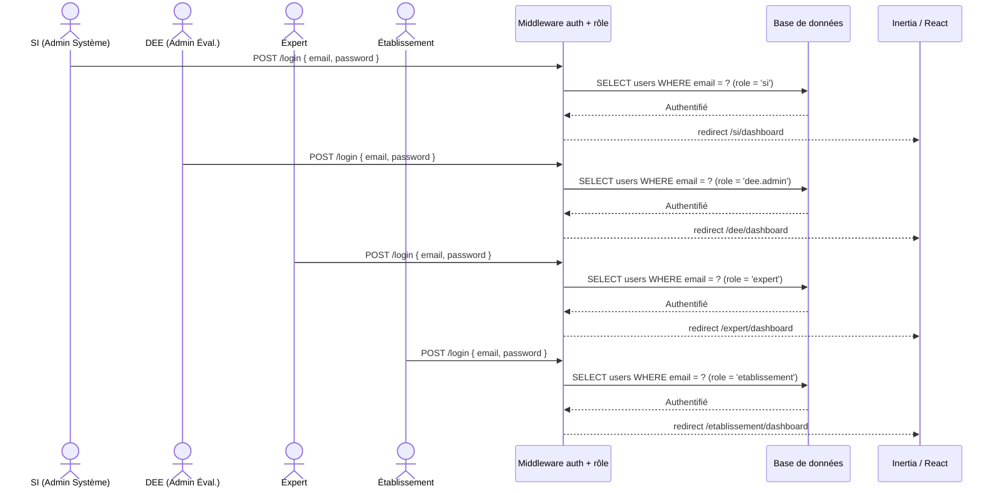
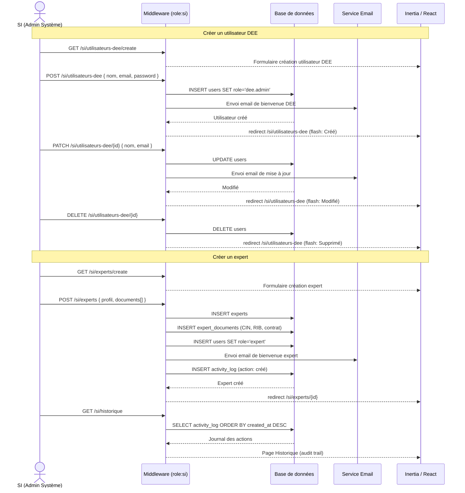
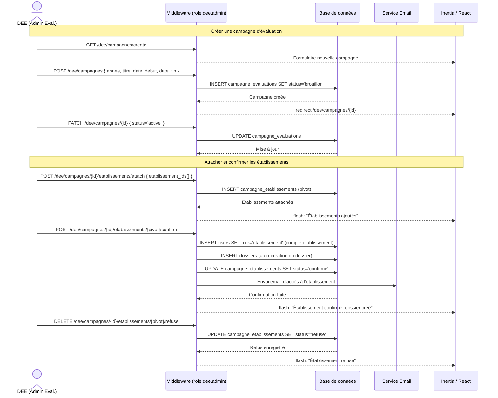
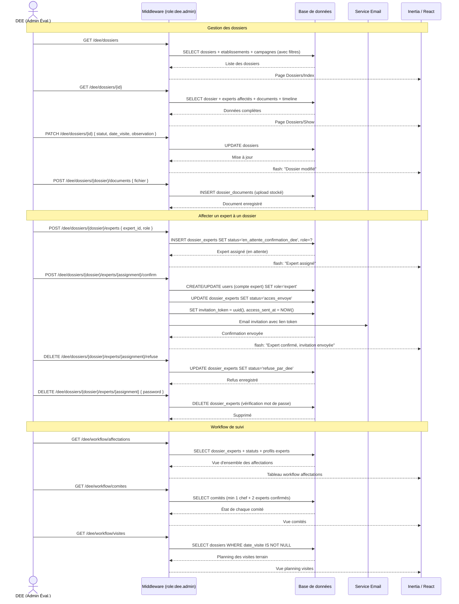
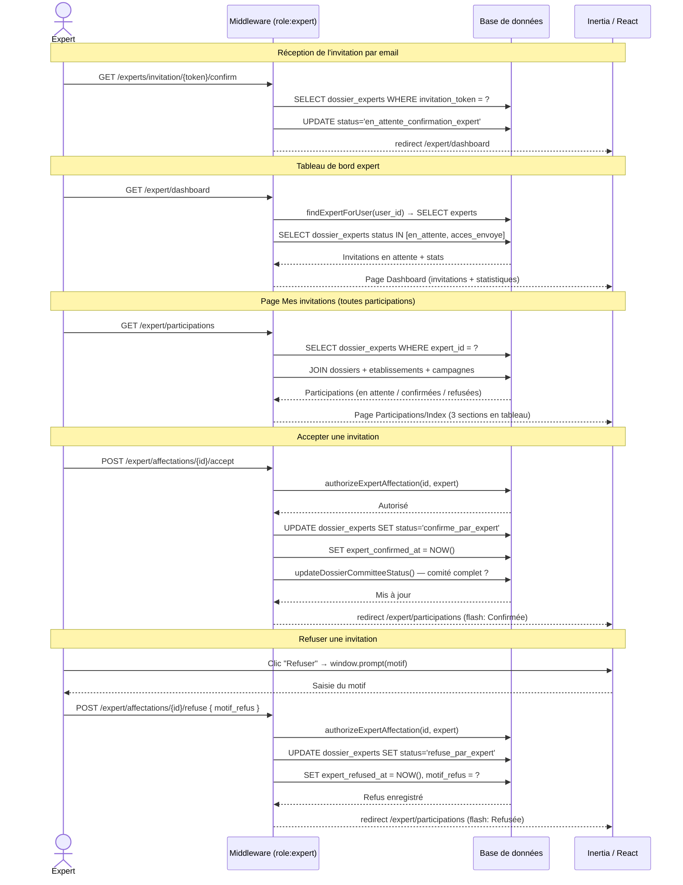
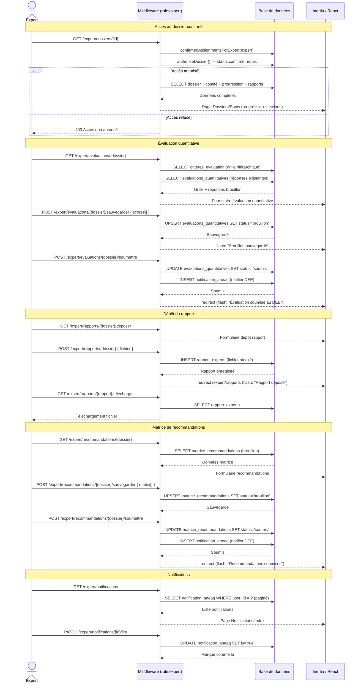
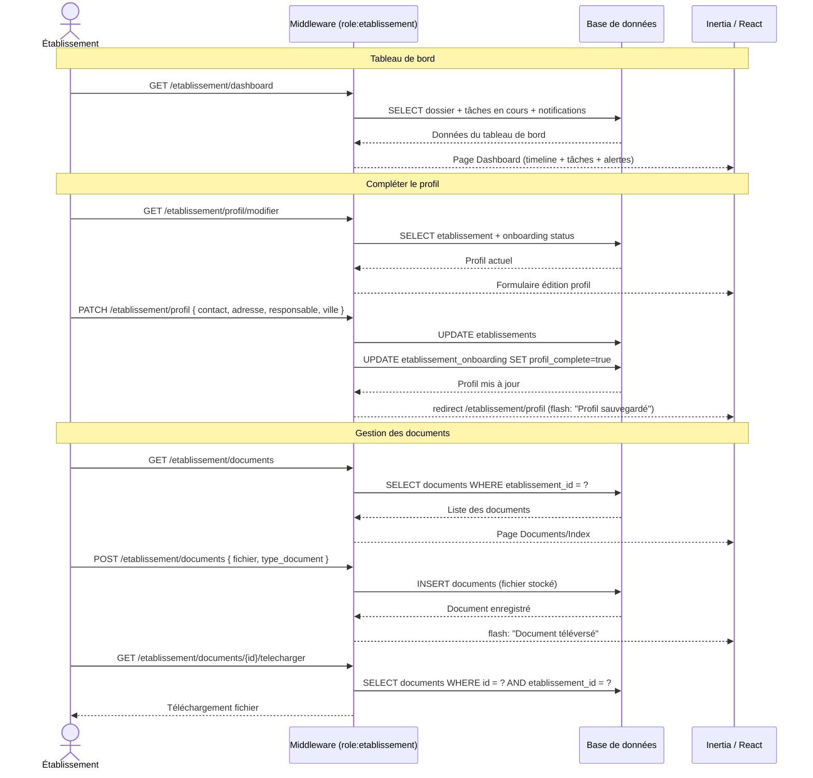
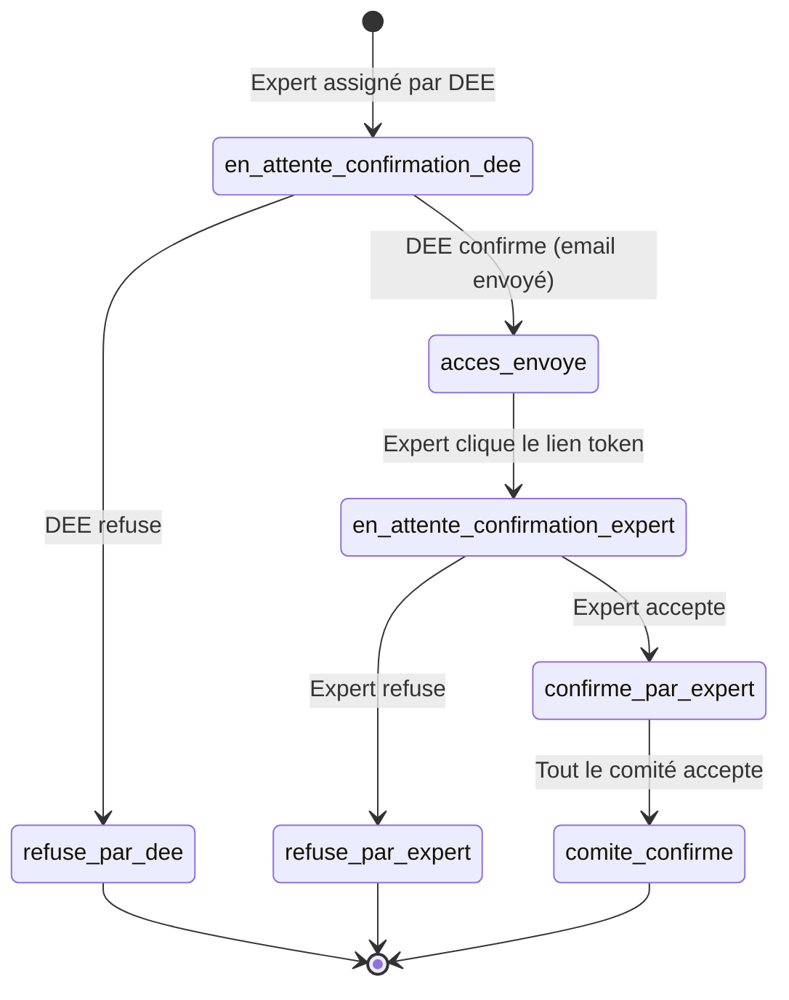

# Diagramme de séquence — Application ANEAQ (Complète)

> Couvre les 4 modules : **SI · DEE · Expert · Établissement**

---

## Flux 1 — Authentification & Routage par rôle

---

## Flux 2 — Module SI : Gestion des utilisateurs & experts

---

## Flux 3 — Module DEE : Campagne & Établissements

---

## Flux 4 — Module DEE : Dossiers & Affectation des experts

---

## Flux 5 — Module Expert : Invitation & Participation

---

## Flux 6 — Module Expert : Évaluation, Rapport & Recommandations

---

## Flux 7 — Module Établissement : Profil & Documents

---

## Vue d'ensemble des statuts — `dossier_experts.status`

---

## Récapitulatif des rôles et accès

| Rôle | Préfixe URL | Accès principal |
|------|-------------|-----------------|
| `si` | `/si` | Gestion utilisateurs DEE + experts + historique |
| `dee.admin` | `/dee` | Campagnes, dossiers, affectation experts, workflow |
| `expert` | `/expert` | Participations, évaluations, rapports, recommandations |
| `etablissement` | `/etablissement` | Profil, documents, suivi dossier |
