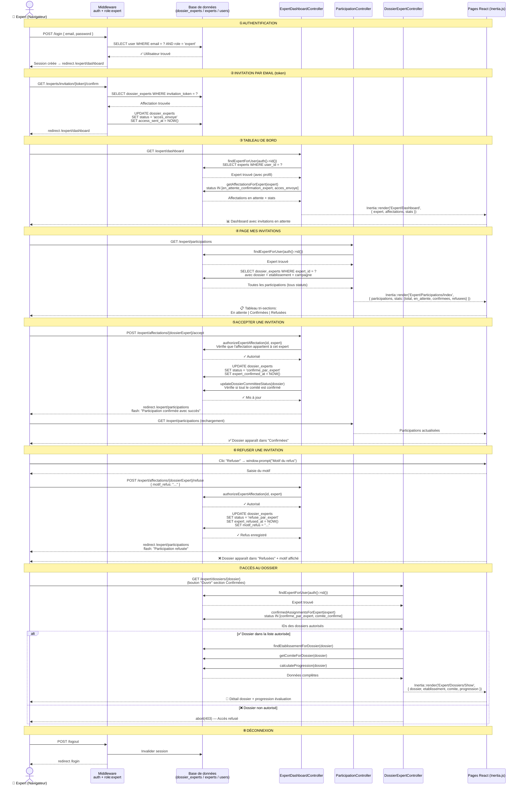

# Diagramme de séquence — Demandes de participation Expert



## Résumé des acteurs

| Acteur | Rôle |
|--------|------|
| **Expert** | Utilisateur authentifié avec rôle `expert` |
| **Middleware** | Vérifie l'authentification + le rôle à chaque requête |
| **Base de données** | Table principale : `dossier_experts` (pivot expert ↔ dossier) |
| **ExpertDashboardController** | Gère le dashboard + les actions accept/refuse |
| **ParticipationController** | Gère la liste complète des participations |
| **DossierExpertController** | Gère l'accès aux dossiers confirmés |
| **React / Inertia.js** | Rendu des pages côté client |

## Statuts du flux (`dossier_experts.status`)

```
en_attente_confirmation_dee
         ↓
  acces_envoye  ←─── Invitation email (token)
         ↓
en_attente_confirmation_expert
         ↓                    ↓
confirme_par_expert    refuse_par_expert
         ↓
  comite_confirme  ←─── Quand tout le comité accepte
```
